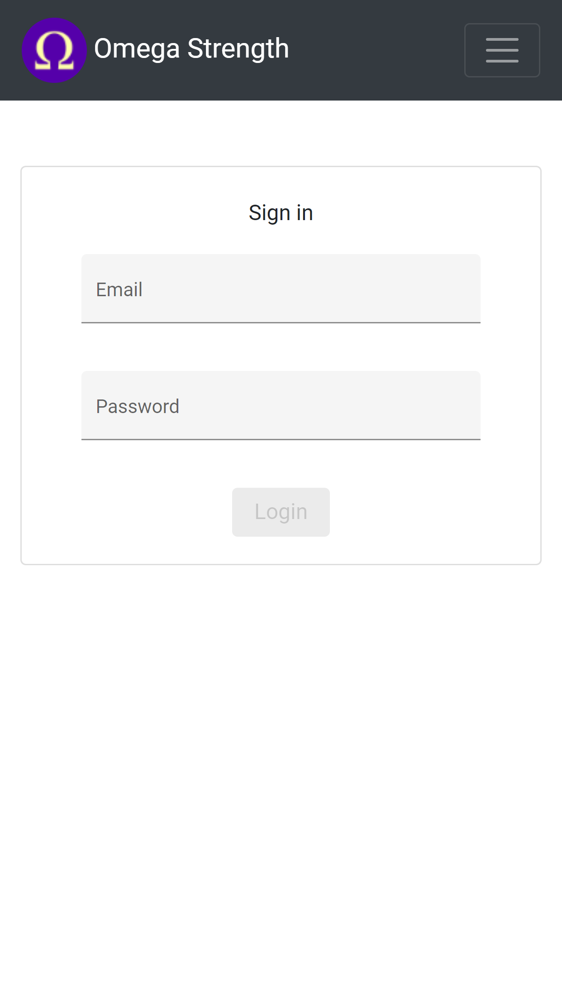
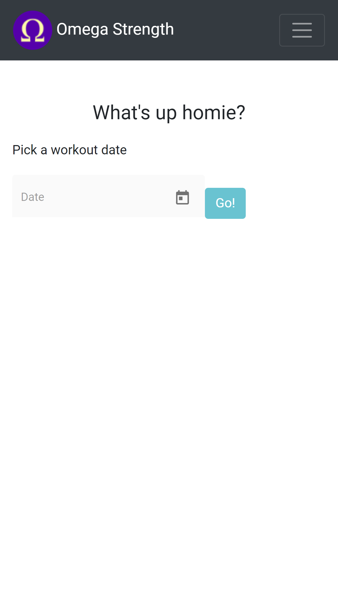
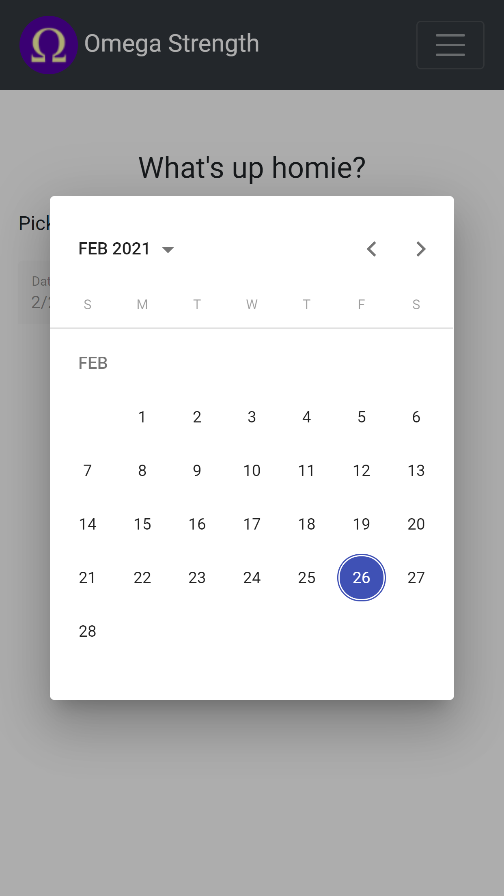
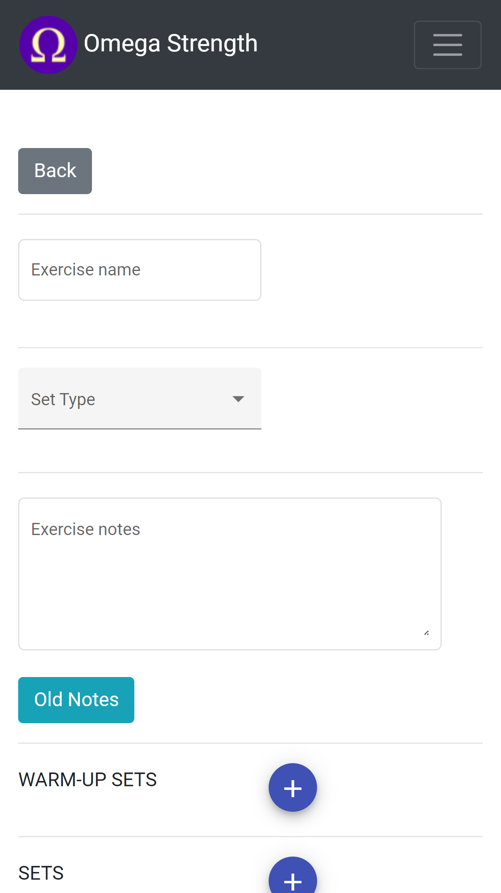
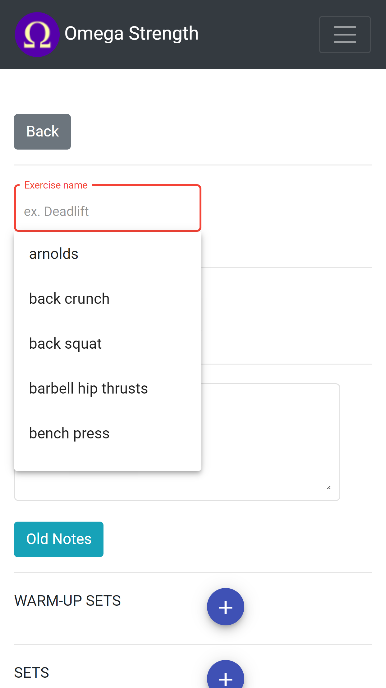
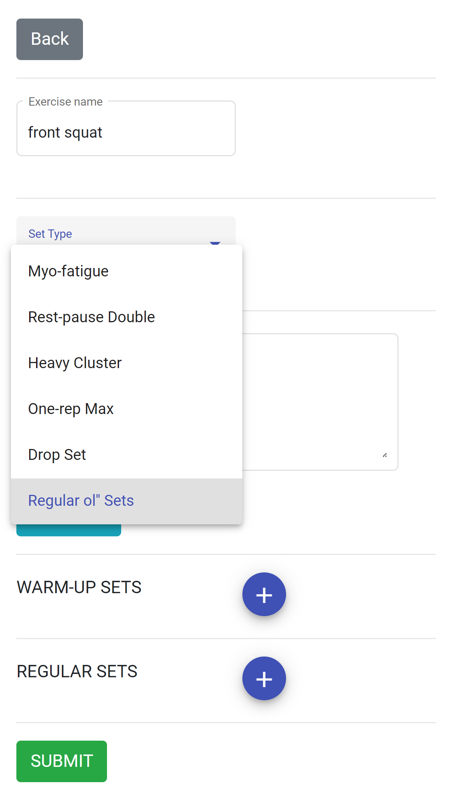
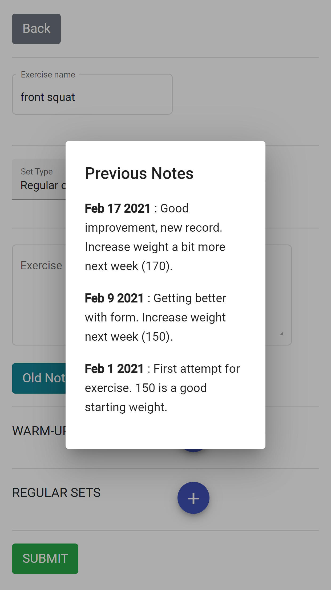
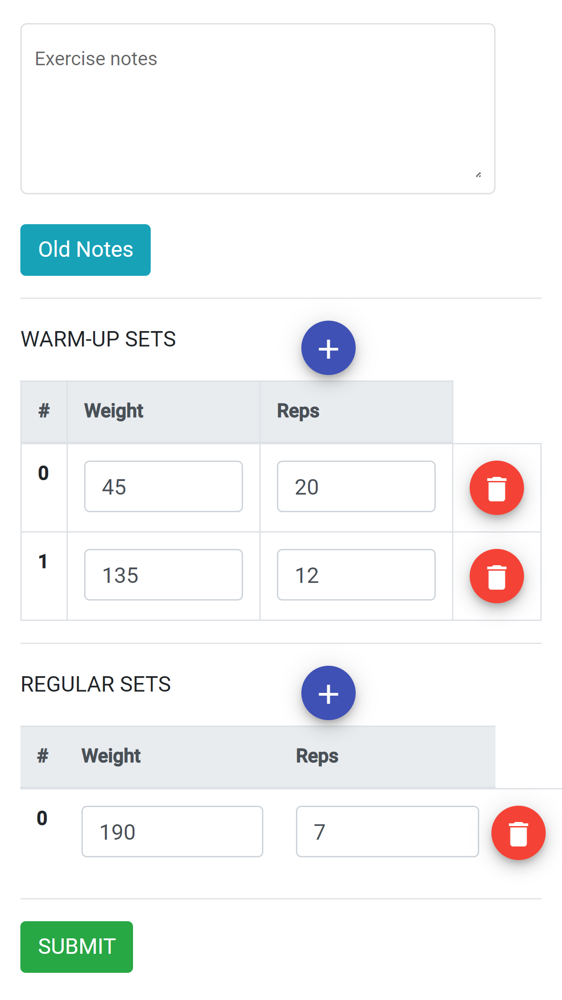
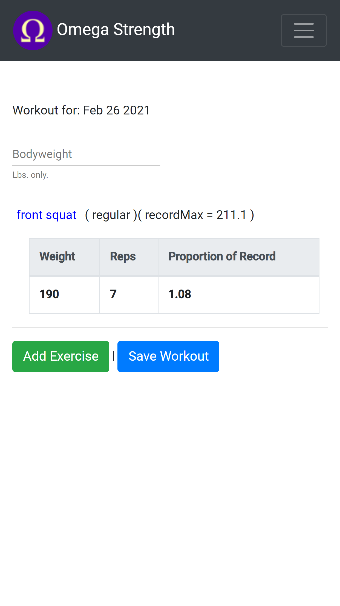
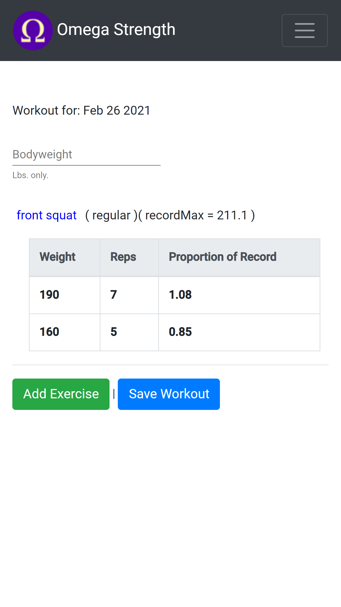

# Omega-Strength

Omega-Strength (abrv: Ohm-str) is a web application for strength trainers. It allows the users to record their training, track records, and compare current performance with those records. It was created in Angular, is hosted by Google Firebase, and uses Firebases's Realtime Database (NoSQL).

## Table of Contents
+ [Introduction](#introduction)
+ [Technologies](#technologies)
+ [Functionality](#functionality)

## Introduction

This project was created by me (Nathan Foss) to showcase my understanding of Angular and as a tool that I use in my own fitness regimen.

The application was built mobile-first with an eye for simplicity. The functionality and interface are meant to emulate a basic logbook. With the addition of material-design components, the process of recording works is very streamlined.

While this app is no longer in active development, I still use it nearly everyday in my training.

## Technologies

- Angular 8+
- Typescript
- RxJS
- Bootstrap 4+
- Angular-Material

## Functionality

### Login and getting started

Ohm-Str uses Firebase Authentication (leveraging OAuth 2.0). Existing users can sign in, but all new users must personally ask me to sign up. The sign-in form uses classes from Bootstrap 4. 

Once signed in, the landing page displays a datepicker (the Angular Material datepicker is used here). You can chose a past date when you worked out, the current day, or plan workouts for a future date.

<table>
  <tr>
    <td><strong> Authentication </strong></td>
    <td><strong> Home page </strong></td>
    <td><strong> Datepicker </strong></td>
  </tr>
  <tr>
    <td></td>
    <td></td>
    <td></td>
  </tr>
 </table>

 ### Entering exercises

After picking a date, you can start adding exercise entries for that day. You may choose from existing exercises within the database, using the Angular Material typeahead to make your selection. Alternatively you may enter a new exercise name. Saving a new exercise makes it available as a typeahead option. We will use the "front squat" exercise for this example.

<table>
  <tr>
    <td> <strong> The workout </strong> </td>
     <td><strong> Add exercise </strong> </td>
     <td><strong> Name autofill </strong></td>
  </tr>
  <tr>
    <td></td>
    <td></td>
    <td></td>
  </tr>
 </table>

  ### Set-types, notes, and warm-ups

You have some options for customizing your sets (using the Angular Material select component). Ohm-Str supports different types of sets, including varieties of rest-pause and drop-sets (we will use regular sets for now). 

Since this app is meant to emulate a logbook, you can write notes for a block of sets and access notes from previous logs (for the current exercise). This has been helpful for me to adjust my workload and stay on track with my program. This exercise's notes are displayed in a modified Angular Material dialog component.

In addition to working sets, you can enter your warm-up sets. 

 <table>
  <tr>
	<td><strong> Set types </strong></td>
    <td><strong> Previous notes </strong></td>
     <td><strong> Warm-ups and working sets </strong></td>
  </tr>
  <tr>
	<td></td>
	<td></td>
    <td></td>
  
  </tr>
 </table>

 ### Previous records and saving progress

After saving the exercise, the workout page displays your results (*the warm-up sets are intentionally omitted*). Each exercise has a table (Bootstrap) with the exercise name, set-type, and the previously calculated **one-rep maximum record (1rm)**. Your calculated 1rm is the metric by which all strength-training progress is measured. **You can read more about it [here](https://en.wikipedia.org/wiki/One-repetition_maximum)**.

Each row in the table represents a set performed for that exercise. It displays the weight and reps, but also a metric to compare your performance to the previously set record. In our example, this means that 190 lbs. at 7 repetitions calculated to a 1rm (about 228 lbs) that was *1.08 times that of the previous record* - a good sign that training is going well.

Sets that fall below the record are also shown. Knowing when you are progressing vs. regressing is important for adjusting your program to maintain progress.

When you are done with your workout, click the 'save workout' button. Once again the Angular Material Design library is used here to indicate a successful save (snackbar).

 <table>
  <tr>
	<td><strong> Exercise display </strong></td>
    <td><strong> Progress vs. records </strong></td>
     <td><strong> Saving progress </strong></td>
  </tr>
  <tr>
	<td></td>
	<td></td>
    <td></td>
  
  </tr>
 </table>
